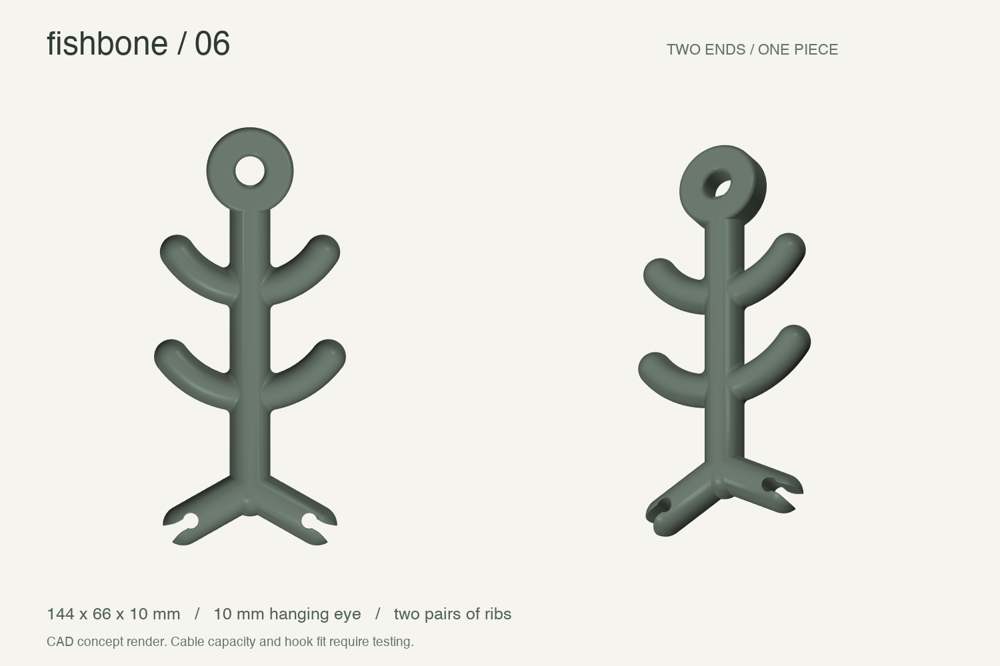
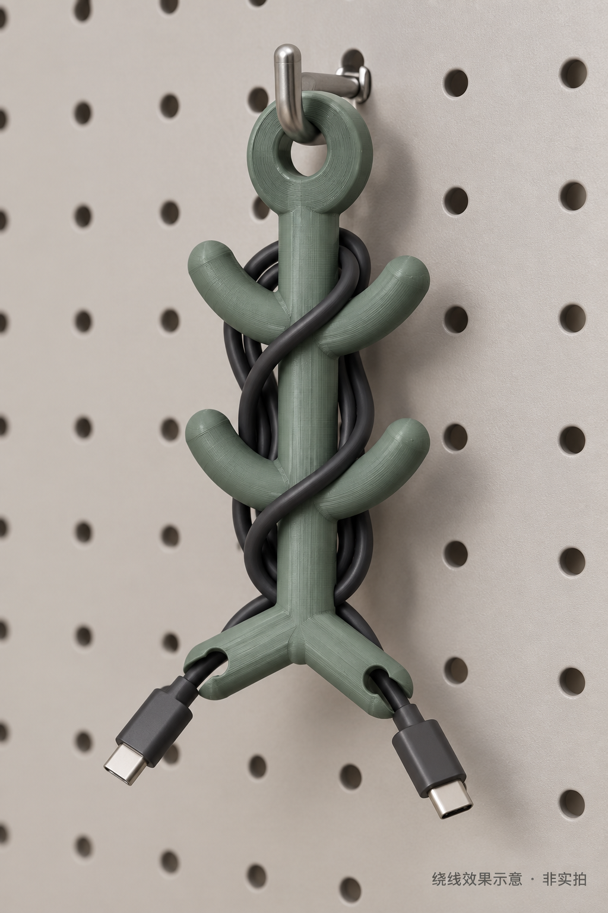

# Fishbone · 鱼骨收线器

简约、稀疏、带浅弧骨节的 3D 打印收线器。用一个整体零件整理闲置线缆，挂在工具墙洞洞板**现有挂钩**上。

A minimal, one-piece 3D-printable cable organizer with sparse curved ribs, two cable-end slots and a hanging eye for **existing pegboard hooks**.

**当前版本：V06 · 首件试打印 / First prototype print**
2026-09-22：用户确认首件打印完成，提供实拍，并反馈“比想象中大一些，挺方便的”。保留当前 V06 尺寸，不做紧凑版；长期性能和容量仍待验证。The first print is complete, with a real photo and positive initial usability feedback. Keep the current size; no compact version is planned.



*依据 V06 模型生成的设计渲染。展示色为灰绿色，本次实际打印材料为黑色 PLA。 / CAD render; the first print uses black PLA.*

## 首件实拍 / First printed sample


用户提供的真实照片：线缆已绕在骨节之间，两个插头留在尾部。线长、线径、卡口保持力及挂钩悬挂稳定性尚未测量。 / User-supplied photo; cable length, diameter, retention and hanging stability are not yet measured.

## 设计要点 / Design

- **两对浅弧骨节**：稀疏布局，圆润截面，保持简约外形。
- **双端卡线**：鱼尾两侧各一个卡槽，尝试分别固定靠近两个插头的线身。
- **独立挂孔**：直径 10 mm，挂在已有挂钩上，无需另做洞洞板接口。
- **一体平背**：背面平放打印；骨节根部圆角过渡，无额外束线带。

Two pairs of rounded curved ribs, mirrored cable slots, a 10 mm hanging eye and a flat back. No separate cable ties are required by the intended design.

| 尺寸 / Dimension | V06 |
| --- | --- |
| 长 × 宽 × 厚 / L × W × H | 约 / approx. 144 × 66 × 10 mm |
| 挂孔 / Hanging eye | Ø 10 mm |
| 卡槽最窄处 / Slot throat | 3.6 mm |
| 卡槽圆形容纳区 / Round pocket | Ø 5.4 mm |
| 骨节根部圆角 / Root fillet | 2 mm |
| 卡口上部接触边圆角 / Upper slot edge fillet | 0.3 mm |

## 绕线效果 / Winding concept



**AI 生成的效果示意，非实拍，也不是经过验证的绕线路径。** 图中线缆、插头和挂钩的比例及贴合程度不能用于判断实际容量。 / **AI-generated illustration, not a photograph or verified routing simulation.**

预期使用：一侧卡槽固定第一端附近的线身 → 沿骨节绕线 → 对侧卡槽固定另一端附近的线身 → 用顶部挂孔悬挂。插头留在外面，卡口不用于承重；不强塞粗线。

Intended use: retain the cable near one connector, wind around the ribs, retain the other end, then hang from the eye. Leave connectors outside. Slot fit and routing require physical testing.

设计目标包含数据线、电源线和网线。先用一根柔软的 1–2 m 数据线验证；**3–5 m 或较粗线缆的容量尚未确认**，也未验证不同线缆的弯曲半径。存放前断开线缆，不作为带电电源线卷盘使用。

Data, power and Ethernet cables are intended use cases. Start testing with a flexible 1–2 m data cable. Capacity for 3–5 m or thicker cables, bend radius and hook fit remain unverified. Store disconnected cables.

## 下载 / Downloads

- [V06 STEP · CAD 实体](models/v06/fishbone-v06.step)
- [V06 STL · 打印网格](models/v06/fishbone-v06.stl)
- [打印设置与首件记录 / Print settings and first-print log](docs/PRINTING.md)
- [设计演进 / Design history](docs/DESIGN.md)
- [几何检查原始记录 / Original geometry checks](models/v06/validation.json)

另附 3.2 / 3.6 / 4.0 mm 卡槽小样的 STEP/STL，见 [模型目录](models/v06)。首件打印选用完整 V06，未打印这些小样。

Optional slot gauges are included for fit trials; they were not part of the first full-body print.

## 本次切片 / First-print slicing

| 项目 / Setting | 值 / Value |
| --- | --- |
| 打印机 / Printer | Bambu Lab P1S |
| 喷嘴 / Nozzle | 0.4 mm |
| 材料 / Material | 黑色 PLA Basic / Black PLA Basic |
| 层高 / Layer height | 0.20 mm |
| 墙层数 / Wall loops | 4 |
| 顶部 / 底部层数 / Top / bottom layers | 5 / 5 |
| 填充 / Infill | 25% |
| 支撑 / Supports | 关闭 / Disabled |
| 摆放 / Orientation | 平背朝下 / Flat back down |
| 切片估算 / Estimated duration | 41 min 18 s |
| 切片耗材 / Estimated filament | 25.29 g · 8.35 m |
| 总层数 / Layers | 50 |

以上是本次试打印设置与估算，不是完成时间或成功质量证明。Actual duration and print quality have not yet been confirmed.

## 复现 CAD / Rebuild

使用 Python 3.12 与 uv：

```sh
uv sync --locked
uv run python src/design.py
```

会重新生成 `models/v06/` 的 STEP、STL、卡槽小样及几何检查记录。依赖版本锁定于 `uv.lock`。

The build validates a single solid, positive watertight main STL and STEP round-trip volume error below 1e-6. These are geometry checks, not strength tests. The original validation record predates slicing; current print status is maintained in the print log.

## 下一步 / Next

- [x] 首件打印完成与照片 / Completion and real photos
- [ ] 双端卡槽取放与固定效果 / Both slot fit and retention
- [ ] 骨节表面、毛刺与绕线手感 / Surface and winding comfort
- [ ] 挂钩适配及悬挂稳定性 / Hook fit and hanging stability
- [ ] 按线径和长度记录容量 / Capacity by cable diameter and length

相关项目 / Related: [MacBook vertical stand](../macbook-vertical-stand).
