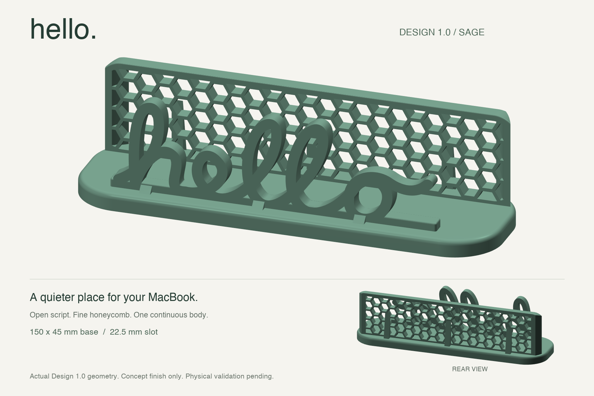
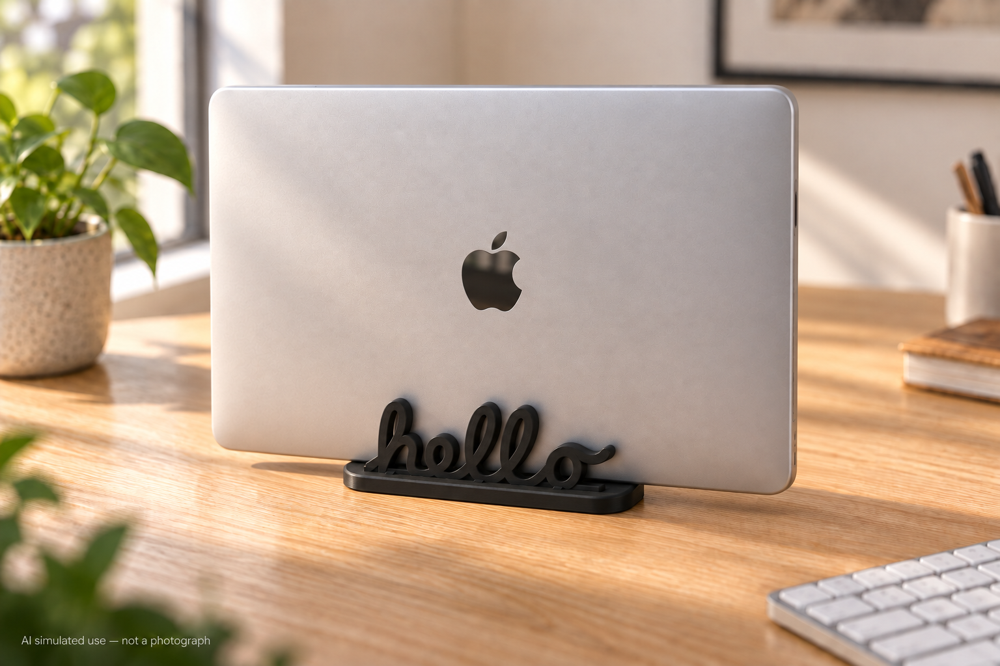

# hello 竖放支架 · 1.0 设计定稿

**hello Vertical Stand · Design 1.0**

单槽合盖 MacBook 支架设计档案：正面为开放连笔 hello 挡架，后面为圆角蜂窝挡架。hello 为自行绘制，不是苹果官方字体。

A parametric, single-slot stand designed to hold a closed MacBook vertically. An open handwritten **hello** forms the front support, paired with a rounded honeycomb frame at the rear. The lettering is custom-drawn, not an official Apple typeface.

[中文介绍](#中文介绍) · [English overview](#english-overview)

## 首次打印进展 / First print status

**2026-09-16 记录：已完成切片并提交首次完整支架打印，用户随后确认完整打印完成，并反馈“感觉用起来挺不错的”。** 使用 P1S、0.4 mm 喷嘴和 A4 黑色 PLA，切片预计 2 小时 24 分钟、56.22 g。完成及初步使用体验来自用户反馈；尺寸测量、强度、防倾倒及长期稳定性尚未系统验证。这是一条进展快照，不是实时设备状态。

**Snapshot, 2026-09-16:** the full stand was sliced and submitted to a P1S with a 0.4 mm nozzle and black PLA in slot A4. The user subsequently confirmed print completion and reported a positive initial experience using the stand. Estimated duration: 2 h 24 min; material: 56.22 g. Completion and initial usability are user-reported; measured fit, strength, tipping and long-term stability remain unverified.

详细记录 / Detailed record: [首次完整打印与设计回顾](docs/first-print-2026-09-16.md)。



*基于 Design 1.0 真实模型的鼠尾草绿展示渲染。颜色与表面质感仅为展示设定，不代表实物照片或已完成打印；不改变模型几何。*

*Rendered from the actual Design 1.0 geometry. The sage color and surface finish are presentation concepts, not a photograph of a printed product. The model geometry is unchanged.*

## 模拟使用效果 / Simulated use



用户于 2026-09-24 确认的 AI 模拟效果图：黑色 PLA 支架、银色合盖 MacBook，补充盖面 Apple 标志，并按约 150 mm 底座与约 300 mm 电脑宽度调整视觉比例。用于展示桌面搭配，不是实拍或精确装配验证；模型尺寸以 STEP/CAD 为准。

AI-generated use visualization, approved on 2026-09-24; not a photograph or an exact fit verification. The Apple logo identifies the depicted laptop and does not imply endorsement or affiliation.

## 中文介绍

这个项目探索一款圆润、低调的桌面竖放支架：让合盖电脑占用更少的桌面空间，同时把连笔文字和蜂窝结构直接融入支撑造型。前侧 hello 本身就是开放挡架，背面细密蜂窝延伸至圆角边框，底部与底座连成一个整体。

Design 1.0 是当前稳定设计基线，提供可修改的参数化源码、主体和试槽的 STEP/STL 文件、可旋转三维预览以及几何验证记录。设计以标称厚度 15.5 mm 的裸机为适配假设，通过双侧软垫保护接触面；胶层、软垫压缩及打印误差仍需实测试装确认。

**设计要点**

- 开放连笔前挡架与细密蜂窝后框，保留轻盈通透的外观。
- 150 × 45 mm 紧凑底座，带脚垫浅槽和局部加强筋。
- 22.5 mm 裸槽，预留前后各 3 mm 软垫的位置。
- 配套 30 mm 长的小试槽，先验证松紧，再考虑完整打印。

“设计定稿”表示当前确定的设计基线，**不代表经过实物强度或防倾倒验收**。建议先阅读 [Design 1.0 说明与测试清单](v14/README.md)。

## English overview

This project explores a compact desktop stand with a restrained, rounded shape. It is intended to reduce the desk space occupied by a closed laptop while making the lettering and honeycomb pattern part of the supporting structure. The open **hello** lettering forms the front support itself, and the fine honeycomb rear frame connects to the base as one continuous body.

Design 1.0 is the current stable design baseline. The repository includes editable parametric source code, STEP/STL files for the stand and fit gauge, a rotatable 3D preview, and geometry validation records. Fit is based on an assumed bare-device thickness of **15.5 mm**, with soft pads on both sides. Adhesive thickness, pad compression, and printing tolerances still require a physical fit check.

**Design highlights**

- Open script lettering at the front and a fine honeycomb frame at the rear.
- A **150 × 45 × 6 mm** base with recessed foot-pad locations and local reinforcing ribs.
- A **22.5 mm** bare slot, leaving a nominal **16.5 mm** gap after adding a **3 mm** soft pad to each side.
- A separate **30 mm-long fit gauge** for checking the padded fit before printing the full stand.

**Validation status:** the final models passed single-solid validity, STEP round-trip volume consistency, and watertight, positive-volume STL checks. The first full print is complete according to the user, who reported a positive initial experience. Documented inspection, measured fit, load, tipping and long-term stability tests remain pending. The full-perimeter fillet on the hello lettering was rejected during export validation and is absent from the final model; soft pads must protect actual device contact areas. The narrow base needs particular attention to sideways pushes and cable pulls.

“Design 1.0” refers to the design baseline, not a physically validated product. Print and check the fit gauge first, then inspect the full model in a slicer and test the completed stand with a protected substitute load before using a laptop. Detailed dimensions and the physical test checklist are available in the [Design 1.0 notes (Chinese)](v14/README.md).

## 1.0 设计定稿 / Design 1.0

- 底座 150 × 45 × 6 mm，裸槽 22.5 mm；双侧各贴 3 mm 软垫后名义净距 16.5 mm。
- 前侧根部及后侧支撑筋已加强，后框接触边与底部连接条局部倒圆。
- **用户确认首次完整打印完成，初步使用反馈良好；尺寸、承重、防倾倒及长期稳定性尚未系统验证。** 几何检查通过不代表实际安全可用。
- hello 整圈圆角未通过导出检查，最终版本未采用；实际接触处仍须软垫保护。
- 通常建议先打印匹配的小试槽；本次用户选择直接打印完整支架，试槽未执行。45 mm 窄底座仍需验证侧推和线缆牵拉时的稳定性。

| 内容 / Contents | 文件 / Files |
| --- | --- |
| 说明与测试清单 / Notes and test checklist | [v14/README.md](v14/README.md) |
| 主体模型 / Stand | [STEP](v14/stand-v14.step) · [STL](v14/stand-v14.stl) |
| 匹配小试槽 / Fit gauge | [STEP](v14/fit-gauge-v14.step) · [STL](v14/fit-gauge-v14.stl) |
| 参数化源码 / Parametric source | [v14/design.py](v14/design.py) |
| 几何检查记录 / Geometry checks | [v14/validation.json](v14/validation.json) |
| 三维预览 / Interactive 3D preview | [v14/viewer.html](v14/viewer.html)，下载后本地打开或启动下述服务 / Download and open locally, or serve as below |

本项目将 STEP、STL、预览及验证报告作为设计交付物随源码保存。当前目录仅保留 Design 1.0，旧版已移除，仍可通过 Git 历史恢复。稳定版指设计基线，实物验证仍待完成。

## 运行与检查 / Build and preview

需要 Python 和 uv。现有建模使用 CadQuery、Matplotlib、trimesh、Shapely；不同版本按各自 README 运行。

Requires Python and uv. Run the commands below from the repository root. The build regenerates the Design 1.0 artifacts and runs the embedded geometry checks; no files from earlier versions are required.

```sh
cd v14
uv run --with cadquery==2.8.0 --with matplotlib==3.11.2 --with trimesh --with shapely==2.1.2 python design.py
uv run --with ruff==0.15.6 ruff format --check design.py
uv run --with ruff==0.15.6 ruff check design.py
uv run --with trimesh python -m http.server 8776 --bind 127.0.0.1
```

预览地址：http://127.0.0.1:8776/viewer.html。建模脚本会重新生成当前目录交付物，并执行有效单实体、STEP 回读体积一致性、STL 闭合正体积和重载检查。未配置独立静态类型检查器。Design 1.0 生成只依赖本目录源码和独立预览模板，不需要旧版文件。

本项目采用总仓库的 [MIT 许可证](../LICENSE)。

Open the preview at [localhost:8776](http://127.0.0.1:8776/viewer.html). No standalone type checker is configured. Only Design 1.0 is retained in the current tree; earlier designs remain recoverable through Git history. See the root [MIT License](../LICENSE).

## 版本对应 / Version mapping

展示名称“1.0 设计定稿 / Design 1.0”对应原 V14 稳定设计基线。为保持文件链接与复现兼容，`v14/` 目录、模型文件名和 `v14-stable` 历史标签保留。此次仅更新展示命名，尚未升级为经过实物验证的“1.0 正式版”。

The public-facing name **Design 1.0** maps to the original **V14** design baseline. The `v14/` directory, model filenames, and historical `v14-stable` tag remain unchanged for compatibility. This naming update does not indicate a physically validated production release.
