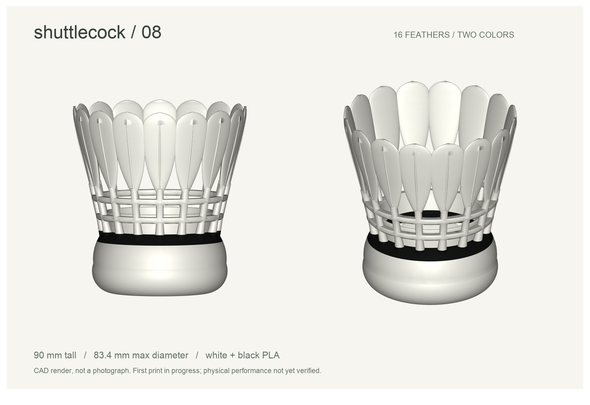
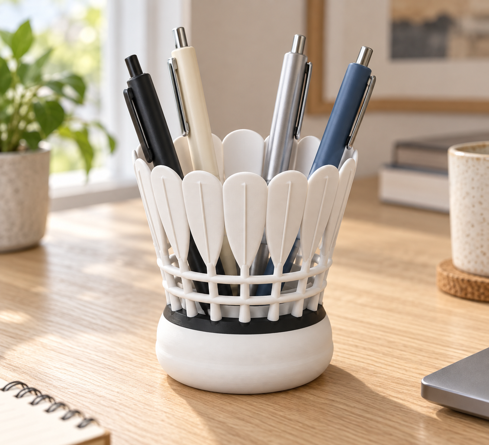

# 羽毛球笔筒 · V08 / Shuttlecock pen holder

首件试打版；H2C 双色切片已完成并检查支撑预览。2026-09-24 已重新提交打印，设备接收任务，实物结果待验收。白色主体搭配球托上沿黑色环带。



[双色 STEP](v08/shuttlecock-v08-two-color.step) · [单色 STL](v08/shuttlecock-v08-single.stl)

## 模拟使用效果 / Simulated use



基于已认可的 V07 外观生成的 AI 桌面使用效果图，用于展示白色主体、黑色环带和装笔效果。V08 在此基础上微调羽梗与羽尖厚度；具体几何以 V08 CAD 文件为准。这不是打印实物照片，不能用来判断表面质量、尺寸精度或强度。

AI-generated visualization based on the accepted V07 appearance, not a photograph. V08 adds small stem and tip reinforcements; the V08 CAD files define the actual geometry.

## V08 打印前微调

保留已认可的 V07 外观。羽梗直径从 3.3 mm 微增至 3.6 mm，配套加强根部过渡；羽尖最后收口的径向厚度由 0.5 mm 增至 1.2 mm，减少过薄尖端。无公司 Logo。

## 按参考图建立的比例

按用户要求以参考图为准，撤回此前的等高 110 mm 限制。V08 总高 90 mm，最大外径约 83.4 mm。缩短羽梗露出长度，连接环位于 z=37、46 mm；上部羽片长 40 mm，宽圆头、下端收窄，细凸羽脉。保留 16 片羽毛、原球托主体和黑白配色，取消同向扭转和人为高低错落。

这版以参考图的视觉比例为依据，未取得原始 CAD 或尺寸，因此仍是照片重建模型。整体 1 个实体；双色零件有效、STL 闭合正体积、STEP 回读与分区检查通过。实物结果待验收。

## 保留的结构优化

- 保留 16 片羽毛、90 mm 高度及约 83.4 mm 最大外径；球托约 64 mm、接地直径 46 mm。
- 羽梗 Ø3.6 mm；根部保留平滑渐变加固套，嵌入球托。
- 两道连接环下边倒角、上沿圆滑化。羽片采用加宽的新轮廓。
- 下部增加高至约 39.6 mm 的短内挡壁，降低笔尖从底部侧孔滑出的机会；上方仍然镂空，不保证所有细物件不会穿出。
- 内底增加 Ø38 × 1 mm 软垫凹位，可选配约 Ø37.5 × 1 mm 软垫；凹位下最小底厚 4 mm。软垫不包含在打印模型内。
- 黑色区域为 z=25–30 mm 的完整截面，厚 5 mm；同层的羽根和内壁也为黑色。这使换色只发生在两个高度边界。

## 双色导入与打印准备

首选导入双色 STEP，保留装配中的白色/黑色零件并分别指定 PLA。若切片软件未保留 STEP 分组，同时导入 [白色 STL](v08/shuttlecock-v08-white.stl) 和 [黑色 STL](v08/shuttlecock-v08-black.stl)，选择“作为一个对象的多个零件加载”。**保持共享坐标，不要分别自动落底或排列。** 白色文件包含上下两个不相连实体，由黑色区域连接成整体；这是耗材分区，不是打印后组装。

单色 STL 是完整单实体，适合全白打印或自行按高度换色。以底座平面朝下、原尺寸打印。H2C 双色切片已完成：0.16 mm 层高、3 圈墙、5 层底壳，自动树状支撑仅从热床生成。预计 4 小时、69.04 g、2 次换料；已提交试打，尚未完成实物验收。详见 [首件打印准备](v08/PRINT-PREPARATION.md)。切片需检查底座外侧悬垂、连接环短桥接、羽尖、根部路径和颜色映射；耗材时间以切片估算为准。满载稳定性、羽根强度及软垫贴合待实测。

## 验证

[v08/validation.json](v08/validation.json) 记录整体与两色零件的 CAD 有效性、STL 闭合正体积、STEP 回读及分区体积守恒检查。整体 1 个实体，白色 2 个实体，黑色 1 个实体；两色无体积重叠、合计体积与整体一致。构建及检查命令见 [AGENTS.md](AGENTS.md)。V01–V07 保留供本地对比。

## English

V08 preserves the accepted V07 silhouette: 16 feathers, 90 mm height and approximately 83.4 mm maximum diameter. Stems are increased from 3.3 to 3.6 mm, with reinforced transitions; the final feather-tip section is thickened to 1.2 mm. White and black parts share coordinates and must remain one multipart object. The black band spans z=25–30 mm. Geometry checks pass. The H2C two-color slice is complete: 0.16 mm layers, three walls, five bottom layers, and build-plate-only tree supports. The slicer estimates four hours, 69.04 g and two filament changes. Support removal still requires a physical trial. A trial job was resubmitted and accepted by the printer on 2026-09-24. Completion, physical strength and stability remain unverified.

## 重新生成 / Rebuild

在仓库根目录运行（依赖由 uv 临时环境提供）：

```sh
uv run --python 3.12 --with cadquery==2.8.0 --with trimesh==4.12.2 --with scipy python shuttlecock-pen-holder/src/build_pen_v08.py
```

脚本同时校验 STEP 回读、网格闭合性和黑白分区。打印参数见 [打印记录](v08/PRINT-PREPARATION.md)。
